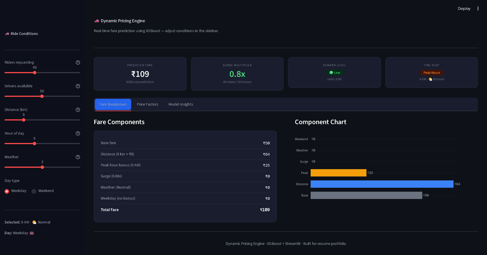
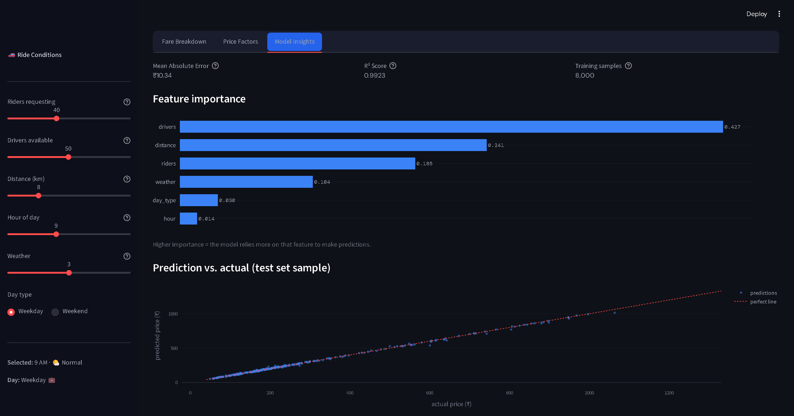

# 🚗 Dynamic Pricing Engine

A machine learning project that predicts ride fares based on real-time ride conditions such as demand, driver availability, distance, weather, time of day, and weekends.

The idea behind this project comes from how ride-sharing platforms like Uber and Ola adjust prices dynamically when demand increases or driver availability decreases. Instead of using fixed pricing, this application uses an XGBoost Regression model to estimate a fare and explain the factors affecting it.

---

## 📌 Project Overview

This project simulates a dynamic pricing system where users can adjust ride conditions through an interactive dashboard and instantly see how the predicted fare changes.

The application generates ride-booking data, trains an XGBoost model, and provides a visual breakdown of the pricing logic.

---

## ✨ Features

- Real-time fare prediction
- Demand vs Driver availability analysis
- Dynamic surge pricing calculation
- Interactive Streamlit dashboard
- Fare component breakdown
- Rider vs Driver heatmap
- Feature importance visualization
- Model performance metrics (MAE & R²)
- Prediction vs Actual comparison chart

---

## 🛠️ Tech Stack

### Programming Language
- Python

### Machine Learning
- XGBoost
- Scikit-Learn

### Data Processing
- Pandas
- NumPy

### Visualization
- Plotly

### Deployment/UI
- Streamlit

---

## 📊 Input Parameters

The model considers the following factors:

| Feature | Description |
|----------|------------|
| Riders | Number of users requesting rides |
| Drivers | Number of available drivers |
| Distance | Trip distance in kilometers |
| Hour | Time of day |
| Weather | Weather conditions |
| Day Type | Weekday or Weekend |

---

## 📈 Model Workflow

1. Generate ride-booking data
2. Calculate fare using pricing rules
3. Train XGBoost Regression model
4. Evaluate model performance
5. Predict fare for user-selected conditions
6. Visualize pricing factors and insights

---

## 🚀 Installation

Clone the repository:

```bash
git clone https://github.com/YOUR_USERNAME/dynamic-pricing-engine.git
cd dynamic-pricing-engine
```

Install dependencies:

```bash
pip install -r requirements.txt
```

Run the application:

```bash
streamlit run app.py
```

---

## 📷 Dashboard Preview

Add screenshots of your application here.

### Main Dashboard


### Pricing Heatmap


### Feature Importance


---

## 📉 Model Performance

The model is evaluated using:

- Mean Absolute Error (MAE)
- R² Score

These metrics help measure how accurately the model predicts ride fares.

---

## 🎯 What I Learned

Through this project I gained hands-on experience with:

- Machine Learning model training
- XGBoost Regression
- Feature importance analysis
- Interactive dashboard development using Streamlit
- Data visualization with Plotly
- Dynamic pricing concepts used in real-world applications

---

## 🔮 Future Scope

Potential improvements that can be explored:

- Real-world ride-booking dataset integration
- Live weather API integration
- Driver location tracking
- Demand forecasting
- Model deployment on cloud platforms

---

## 👨‍💻 Author

Deepraj Patel

If you found this project interesting, feel free to connect with me and check out my other machine learning projects.

---

⭐ If you like this project, consider giving the repository a star.